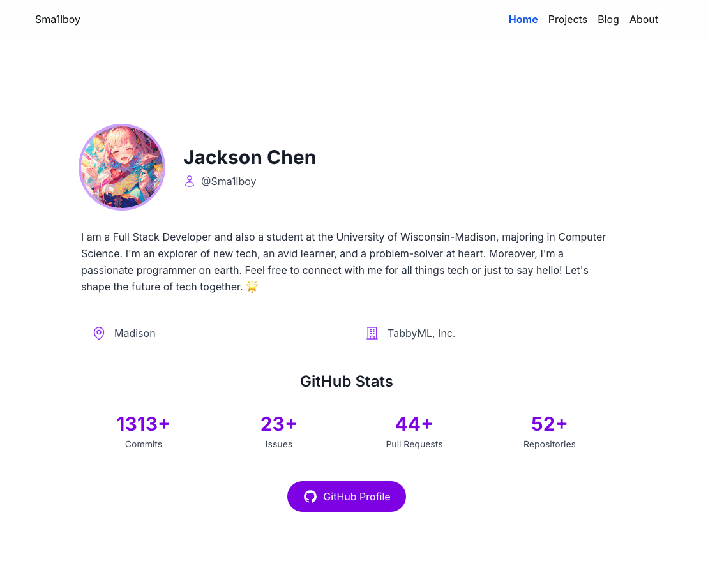

# sma1lboy.me - Personal Website

> [!WARNING] > **This project is currently under construction** 🚧

Welcome to the repository of my personal website! This site is being built to showcase my projects, skills, and experiences in software development.

## 🌟 Features (Planned)

- **Modern Design**: A clean, responsive layout that works on all devices.
- **Project Showcase**: Highlighting my best work and contributions.
- **Blog Section**: Sharing my thoughts and experiences in tech.
- **Interactive Elements**: Engaging visitors with dynamic content.
- **Performance Optimized**: Fast loading times and smooth interactions.

## 🛠️ Tech Stack

This website is built using:

- [Next.js](https://nextjs.org/)
- [React](https://reactjs.org/)
- [Tailwind CSS](https://tailwindcss.com/)
- [TypeScript](https://www.typescriptlang.org/)

## 🚀 Development Status

This project is actively being developed. Features and content are being added regularly. Feel free to watch or star the repository to stay updated on its progress!

## 📚 Future Plans

- Complete the core design and layout
- Implement the project showcase section
- Set up the blog functionality
- Optimize for performance and SEO
- Add interactive elements and animations

## 🤝 Contributing

While this is a personal project, I'm open to suggestions and feedback. Feel free to open an issue if you have any ideas or notice any bugs.

## 📄 License

This project is open source and available under the [MIT License](LICENSE).
